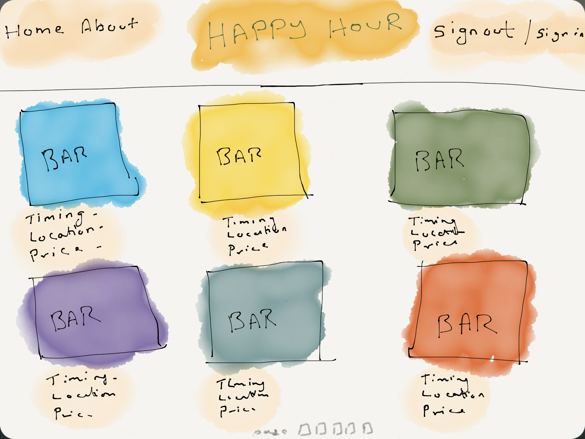

#This is my HappyHour Web App made with Ruby On Rails + Bootstrap and some JavaScript
---

### Description :
###### How many times how you wondered where to grab a drink after work but couldn't decide where? How many times have you over paid for alcohol only to realize there was a One on One offer just a block from where you were?
###### Introducing HappyHour.... A realtime tracker for all bars and restaurants around you to keep track of the dynamic happy hours around you. This site allows you to view based on location and time all the bars and restaurants that have Happy Hours at that very instant so that you can plan your outing accordingly. It will also show you a comprehensive list of prices so you can compare and pick the place that best suits you.

___
#### Current Version 0.1
---
##### Done
1. Initialised rails app.
2. Commited to GitHub repo.
3. Updated README.md
4. Set up Bootstrap
5. Created User Model
6. Created Login System (fully functional)
7. Styled Sign Up and Log In Forms
8. Created Bars and Offers Model
9. Created Users and Bars relation
10. Added Bars index
11. Added functionality to Add / Edit / Delete Bars
12. Added User Account settings with ability to update User details
13. Bootstrap Forms
14. Set up belong_to and has_many relation between Users -> Bars -> Offers
15. Offers have been set up (fully functional)

---

##### Upcoming
1. Add Image gallery and use AWS to host images
2. Each bar should be able to upload multiple images for image gallery
3. Thumbnail images for offers
4. Start Styling

---
##### Known Bugs

---
##### Pivotal Tracker
[Project Management](https://www.pivotaltracker.com/n/projects/1320884)

##### Heroku Link for Production

[Currently Unavailable](#)

---

Wireframe

Data Model [Updated]

Data Model [Old]

---

###Made by Rushindra Sinha